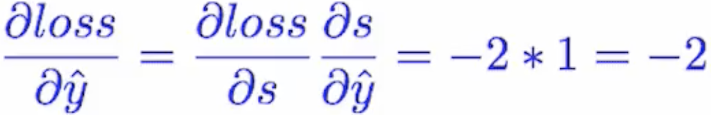

## Learning
- For example, if we have a linear model `y = wx`, we call the `w` **weight**. 
- We often choose the inital value of `w` randomly.
- When we predict, we call the difference with a prediction and an actual value `loss`.
- Learning is finding `w` that **minimizes the loss.**
- As the training proceeds, we `repeatedly update` the w so that we can find minimizes the loss.

- To update the w value, we use follwing equation. `alpha` means `learning rate` which is usually very small number like 0.001, and this also means `The next step is how far from where w is now.`  

- By using derivative, We can update the w in this way: if the drivative value(=gradient) is minus then w will be move toward the posivie side, and visa versa. This kind of update approach is called `Stochastic Gradient Descent Optimization`, or `SGD` for short. There are other more various different Optimizers like Adam, Adamax and so on. 

## MSE
- One of ways to measure the `loss` of a model.
- The Acronym for the **Mean Square Error** which is following equation. `y hat` is a prediction of our model, and `y` is a real value. So, it means simply the sum of differences between forecasts and actual values.

- There are various other loss functions like `BCEloss` for binary loss, and so on.

## Back Propagation
- Back propagation is the way to calculate the derivate value of loss by `w`.
- For example, our model is a linear model, and we use MSE as a loss function. Then, the gates of our model will look like following.

- Let's assume that `x = 1, y = 2, and w = 1`. Then, the forward path is obvious.

- The back propagation starts from the loss with rightmost local gate.

- By using [Chain Rule], we can calculate the derivative of w, step by step. 
- In this example, s was -1, so, the local derative of `square gate` is `-2` , then -2 is passed to the `- gate` as loss. In the `- gate`, y was constant value and y hat was 1, so the derivative is `-2` an the `- gate`.  In this way, the derivative of w becomes `-2`. 

[Chain Rule]:https://en.wikipedia.org/wiki/Chain_rule
