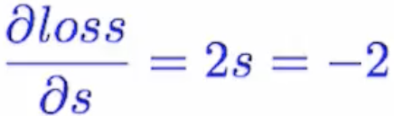

## Learning
- 특정한 값을 예측을 하고 싶다고 하면, 우리는 먼저 실제로 그러한 예측을 할 수 있는 `Model`이 필요합니다. 그리고, 그 모델이 예측한 값과 실제 값과의 값의 차이를 `loss`라고 말합니다.
- 예를 들어, 간단한 선형 모델인 `y = wx`을 우리가 모델로 가지고 있다고 합니다. 이 때, `w`를 우리는 **weight**라고 부릅니다.
- 보통 맨 처음엔 이 `w`를 랜덤하게 고릅니다.
- 학습을 진행을 함에 따라, 우리는 이 w 값을 `반복적으로 update`를 시켜서, loss를 최소화 할 수 있게끔 만듭니다. 
- 그래서 `학습`이라는 것은 **loss를 최소화 시키는 w 찾기**라고 할 수 있습니다. 

- When we predict some values, firstly we need a `model` that can actually do predict, and we call the difference with a prediction and an actual value `loss`.
- For example, if we have a linear model `y = wx`, we call the `w` **weight**. 
- We often choose the inital value of `w` randomly.
- As the training proceeds, we `repeatedly update` this w so that we can find minimizes the loss.
- Therefore, `Learning` is **finding** `w` that **minimizes the loss.**

## Optimizer

- w값을 update시키기 위해서, 우리는 다음과 같은 공식을 씁니다. 여기서 `alpha`가 뜻하는 것은 `learning rate`라고 하는 것인데요, 보통 0.001같은 아주 작은 값이고, 그래서 `다음 학습할 때 쓸 w는 지금 w와 얼마만큼 떨어져있는지`정도를 의미합니다. 

- To update the w value, we use follwing equation. `alpha` means `learning rate` which is usually very small number like 0.001, so it means that `How far the next step w is from where now w is.`  

- 미분을 이용하여, 만약 미분 결과값이 -인 경우, w는 좀더 양수쪽으로 가게 되고, 반대로는 음수로 가는 방식으로 우리는 w를 update할 수 있습니다. 이런 update 방법을 `Stochastic Gradient Descent` 최적화, 또는 줄여서 `SGD`라고 부릅니다. SGD 이외에 최적화 기법으로 Adam, Adamx 등등 다양한 기법들이 있습니다. 

 

- By using derivative, We can update the w in this way: if the drivative value(=gradient) is minus, then w will be move toward the posivie side, and visa versa. This kind of update approach is called `Stochastic Gradient Descent` Optimization, or `SGD` for short. There are other more various different Optimizers like Adam, Adamax and so on. 

## Loss function
- To explain `loss function`, let's take an easy loss function as an example.
- MSE is an one of ways to measure the `loss` of a model.
- The Acronym for the **Mean Square Error** which is following equation. `y hat` is a prediction of our model, and `y` is a real value. So, it means simply the sum of **differences between forecasts and actual values.**

- There are various other loss functions like `BCEloss` for binary loss, and so on.

## Back Propagation
- Back propagation is the way to calculate the derivate value of loss by `w`.
- For example, our model is a linear model, and we use MSE as a loss function. Then, the gates of our model will look like following.

- Let's assume that `x = 1, y = 2, and w = 1`. Then, the forward path is obvious.

- The back propagation starts from the loss with rightmost local gate.

- By using [Chain Rule], we can calculate the derivative of w, step by step. 
- In this example, s was -1, so, the local derative of `square gate` is `-2` , then -2 is passed to the `- gate` as loss. In the `- gate`, y was constant value and y hat was 1, so the derivative is `-2` an the `- gate`.  In this way, the derivative of w becomes `-2`. 

[Chain Rule]:https://en.wikipedia.org/wiki/Chain_rule
